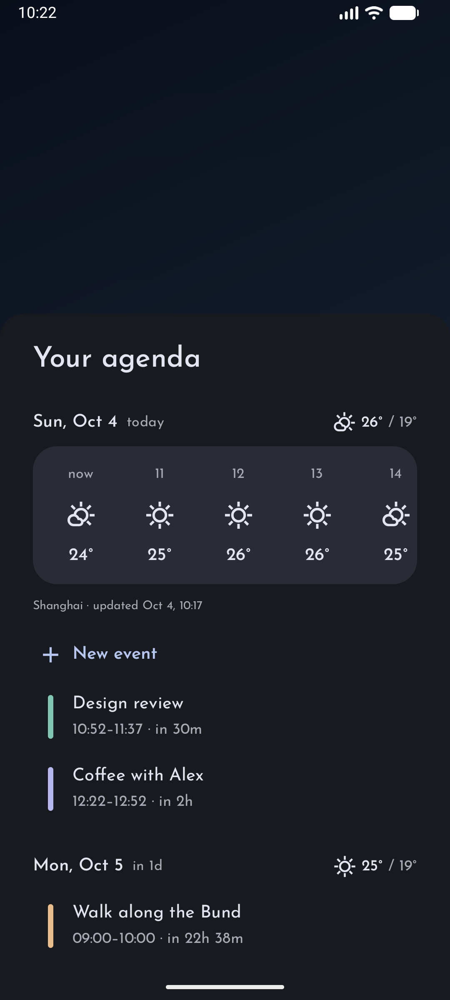
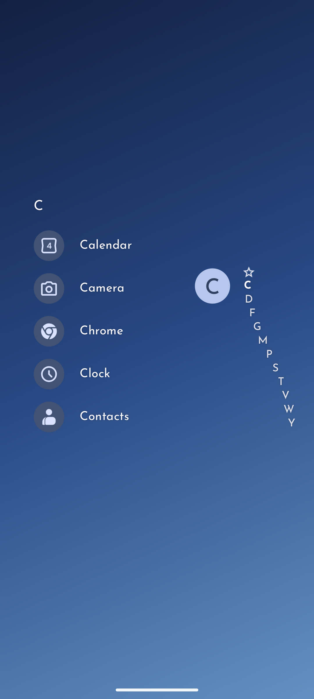

<div align="center">
  

  <h1>Niva Launcher</h1>

  <p><strong>A calm, private, list-based Android home screen.</strong></p>

  <p>
    <a href="https://github.com/shauryasingh9967-ops/niva-launcher/actions/workflows/ci.yml"></a>
    
    
  </p>
</div>

Niva Launcher is a minimalist Android launcher inspired by Niagara Launcher's clean, list-based design.

## Features

- **Minimalist home** — favorites list, alphabetical app drawer with fast-scroll rail, powerful search
- **Focus Mode** — hide distracting apps from favorites, the app list, and search with one toggle
- **Backup & restore** — versioned settings backup to a file you control, restore anytime
- **Appearance presets** — save and switch between complete theme setups in one tap
- **Privacy-first** — no internet permission, no ads, no analytics; all data stays on your device
- **Customization** — icon packs, per-app Icon Designer, custom fonts, clock styles, AMOLED/dark/dynamic themes, wallpaper effects
- **Productivity** — calendar agenda, media controls, home-screen widgets, folders, gestures, app shortcuts

## Screenshots

| Home | Agenda | App list |
|------|--------|----------|
|  |  |  |

## Build

Requires JDK 17 and the Android SDK (see [.github/workflows/ci.yml](.github/workflows/ci.yml) for the exact CI setup).

```shell
./gradlew :app:assembleDebug      # APK: app/build/outputs/apk/debug/app-debug.apk
./gradlew :app:testDebugUnitTest  # unit tests
./gradlew :app:lintDebug          # lint
```

Minimum Android 9 (API 28). Application ID and namespace: `com.niva.launcher`.

## Privacy

Niva Launcher requests no `INTERNET` permission, shows no ads, and collects no analytics.
See [docs/PERMISSIONS.md](docs/PERMISSIONS.md) for every permission and why it exists.

## License

GPL-3.0-or-later — see [LICENSE](LICENSE) and [NOTICE.md](NOTICE.md).
